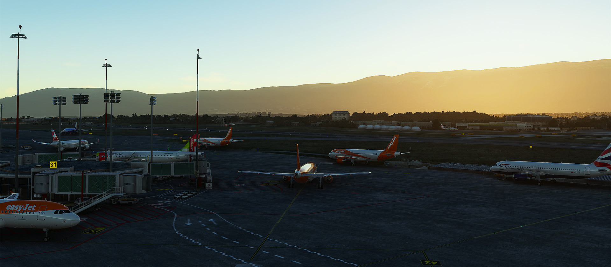

---
hide:
  - navigation
  - toc
---

# Release of AI Traffic in alpha

We are very happy to introduce the Alpha build of our new Traffic feature in BeyondATC! This is an exciting first step in our journey to enhance your flight simulation experience with dynamic and realistic air traffic. This feature is currently available for all our supporters.

!!! warning "Alpha release"
    Traffic is currently in **ALPHA**, this means its a really early version of the traffic product. We believe it will give you plenty of enjoyment in its current state but there will be issues, there may be crashes of BATC and features may be missing. If you find traffic in its current state does not enhance your experience, you can disable it from within the options menu or alternatively if you find the build unstable, switch back the core EA version from your accounts page.

## What’s new?

* **Realistic traffic data**: Experience global traffic based on live data from a historic week. This includes all IFR flights with active transponders.
* **Aircrafts management**: Get ground, departure, and arrival traffic for airports planned in your Simbrief flight, with realistic parking and runway assignments.
* **Model support**: Compatible with FSLTL, AIG, and FS Traffic models. You don't need to run any of their injectors.
* **Voice options**: Customize traffic voices with premium, basic, or no voice options, independently from your player voice settings.
* **Simulator resources management**: Traffic management extends up to 200nm from your aircraft, even when not visible, saving valuable simulation resources.

## Future enhancements

We are continuously working on improving the Traffic feature, with upcoming additions including:

* **Full enroute traffic**: Additional traffic beyond your planned airports
* **Ground Services**: Features like pushback tugs and jetways.
* **Separation Handling**: Dynamic speed management to handle separation between AI aircrafts and you
* **Advanced procedures**: Traffic will be capable of following holding patterns, go-arounds, and more refined handling procedures.

## Get started

We recommend you to go through [our guide](../../onboarding/getting-started/#setting-up-ai-traffic) to set everything up for traffic. For the best experience, start with shorter flights (1-2 hours), choose airports with moderate traffic at the time you are flying.
