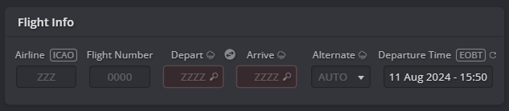
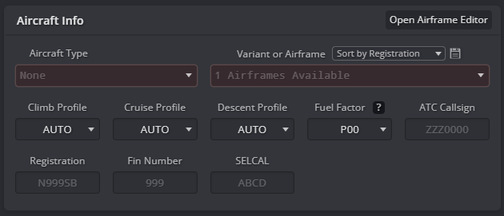
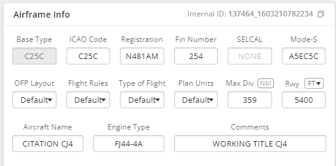
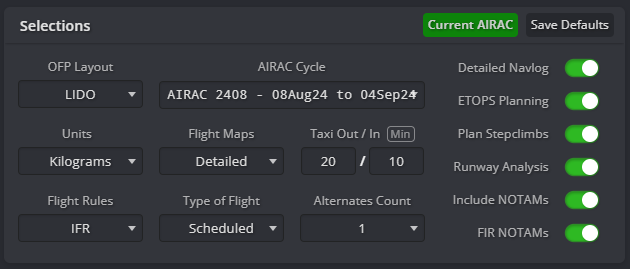
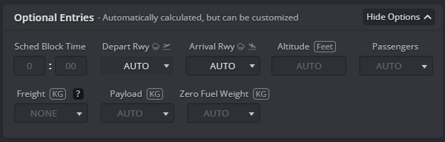

# Preflight

## Creating your flight plan

To start your flight preparation, you’ll need to create a flight plan using Simbrief. Go to [Simbrief Dispatch](https://dispatch.simbrief.com/) and click on **New Flight**. Complete all required fields to generate your flight plan. Below is a breakdown of each section you’ll encounter.

### Flight Info

In the Flight Info section, you need to enter the essential details for your flight plan. Input your airline’s ICAO code and flight number, which BeyondATC will use to define your callsign (if you don't provide a callsign in the next section). Make sure the ICAO code is from a legitimate FAA-registered airline or a virtual airline recognized by the BeyondATC development team. Also, provide the ICAO codes for both your departure and arrival airports.

### Aircraft Info

For the Aircraft Info section, select the aircraft you will be using for the flight. Choose the appropriate aircraft type and, if available, the specific airframe used in Microsoft Flight Simulator. Correctly selecting the airframe ensures accurate performance calculations, including fuel requirements. You can leave other fields at their default settings unless you have specific needs.

#### Setting up your callsign

There are two ways of setting your callsign depending on whether you’re flying an airliner or a general aviation aircraft.

??? note "Add an airliner callsign"
    To set an airliner callsign, use the ICAO three-letter prefix assigned to your airline. Each three-letter prefix is uniquely assigned to one operator worldwide. The complete list of ICAO codes is registered by the FAA and can be found on their website: [FAA ICAO Codes](https://www.faa.gov/air_traffic/publications/atpubs/cnt_html/chap3_section_1.html). Here are a few examples of correct callsigns:

    - For a Swiss flight: SWR3PH (ATC will call you Swiss 3PH)
    - For a British Airways flight: BAW639M (ATC will call you Speedbird 639M)
    - For an EasyJet flight: EZY32ZR (ATC will call you Easy 32ZR)

    **Do not use the two-letter IATA code for your callsign, as it will not be recognized!**

    Once you have chosen your callsign, you can enter it in the ATC Callsign field. This will override your airline and flight number set in the previous section.

??? note "Add an General Aviation callsign"
    In most countries, general aviation flights identify themselves using a callsign that corresponds to the aircraft's registration number (also known as the tail number). General aviation callsigns are pronounced letter by letter and number by number using the ICAO phonetic alphabet. You can find the full list of registration country codes on this [CIA website](https://www.cia.gov/the-world-factbook/field/civil-aircraft-registration-country-code-prefix/). Here are a few examples of GA callsigns:

    - HB-FLB (Switzerland)
    - N595PZ (United States)
    - G-BSOG (United Kingdom)
    - PT-FRD (Brazil)

    To set up a GA callsign, follow these steps:

    1. Ensure that the airline, flight number, and ATC callsign fields are empty.
    2. In Aircraft Info, click on **Open Airframe Editor** and edit the airframe you will be using.
    3. Enter the registration number in the Registration field. Remove any hyphens, so HB-FLB would be entered as HBFLB.

    

### Selections

In the Selections section, adjust settings for your flight plan. To ensure BeyondATC has all the relevant information, make sure the **Detailed Navlog** option is checked. Other settings can be adjusted based on your preferences or left at their default values. 

### Optional Entries

The options in this section are not required and can be left at their default settings. Although you can specify departure and arrival runways, it is generally best to leave these fields on default. BeyondATC generates its own ATIS and assigns an active runway, which may differ from your initial plan.

### Other Sections

Any additional sections and options are optional and can be customized according to your preferences or left at their default values. For more guidance, consider exploring Simbrief tutorials or seeking help in our Discord ATC discussion channel, where community members are available to assist and provide additional resources.

### Generate Your Flight Plan

Once you’ve filled out all the relevant information, click the **Generate Flight** button at the top of the page to create your flight plan. You are all set!

---

## Getting the ATIS

Once you are seated in your plane and BeyondATC is launched, you will begin by listening to the ATIS. 

**ATIS**, or **Automatic Terminal Information Service**, provides essential information about the airport's current conditions and operational status. This includes information on weather, runway in use and other important updates. ATIS broadcasts are updated regularly to reflect the latest conditions and are crucial for planning your approach and departure.

To listen to the ATIS broadcast in BeyondATC:

1. **Tune into the ATIS Frequency:** You can find the ATIS frequency on charts or you can tune it by clicking on the headphone icon and selecting the frequency.
2. **Listen Carefully:** Pay attention to the broadcasted information, which will include a letter code designating the current ATIS message (e.g., ATIS Information Alpha, Bravo, etc.).
3. **Note Key Details:** Take note of the weather conditions, active runways, and any special instructions provided in the ATIS broadcast.

Here is an example of an ATIS broadcast: 
> Geneva Airport Information Oscar. One eight two four zulu. Wind zero one at six. Flew clouds at six thousand four hundred. Temperature one eight. Dewpoint zero six. QNH one zero one six. Landing and departing runway zero four. Transition level zero seven zero. Numerous cranes in operation around Geneva. Advise on initial contact you have information Oscar.

!!! tip "Replay the ATIS broadcast"
    You can listen to the ATIS broadcast as many times as needed, so don't worry if you miss any information initially. Take your time to ensure you capture all the details. For users with Premium Characters, the ATIS broadcast is generated once and then continuously looped. Replaying the broadcast will not consume additional Premium Characters.

**Breaking down the ATIS broadcast:**

- **Information Oscar:** This letter indicates the current ATIS information. ATIS messages are updated periodically, with each new message assigned a sequential letter. Make a note of this letter as you will need to inform ATC that you have this information when asking for IFR clearance.

- **Time (One eight two four zulu):** This is the time when the ATIS was last updated, given in UTC (Zulu) time. Knowing the time helps you gauge how current the information is.

- **Wind (Wind zero one at six):** The wind is coming from 010 degrees at 6 knots. This information is crucial for understanding the wind direction and strength for takeoff and landing.

- **Clouds (Few clouds at six thousand four hundred):** This indicates that there are a few clouds at 6,400 feet above ground level. This helps in assessing the visibility and potential weather conditions you might encounter.

- **Temperature (Temperature one eight):** The air temperature is 18°C. Temperature affects aircraft performance, including takeoff and landing distances.

- **Dewpoint (Dewpoint zero six):** The dewpoint is 6°C. The dewpoint helps determine the likelihood of fog or other weather phenomena.

- **QNH (QNH one zero one six):** This is the atmospheric pressure at sea level, measured in millibars (1016 mb). Set this on your altimeter to ensure accurate altitude readings in your aircraft.

- **Runway Information (Landing and departing runway zero four):** The active runway for landing and departure is Runway 04. This information is important for planning your approach and departure.

- **Transition Level (Transition level zero seven zero):** This is the altitude above which you should use standard pressure (1013 mb) for altitude assignments. Below this level, local pressure settings are used.

- **Special Notices (Numerous cranes in operation around Geneva):** This includes any hazards or special conditions, such as construction or wildlife activities that might affect your flight.

**What to Listen For:**

1. **ATIS Information Letter:** Note the letter in the ATIS broadcast. You need to communicate to ATC that you have this specific information.
2. **Weather Conditions:** Pay close attention to wind, clouds, temperature, and pressure. These factors affect your flight planning and operations.
3. **Runway and Transition Information:** Know which runway is in use and the transition level for accurate altitude assignments.

---

## IFR Clearance

After reviewing the ATIS broadcast and noting the essential information, the next step is to obtain your IFR clearance. This process involves requesting and receiving authorization from air traffic control to operate under Instrument Flight Rules (IFR). Here’s how to proceed:

### Requesting IFR Clearance

1. **Tune to the Clearance Delivery Frequency:** Use the appropriate frequency for Clearance Delivery, which can usually be found on the airport’s ATC frequency list or provided by the ATIS.

2. **Contact Clearance Delivery:** Make your call using the following format:
    > Geneva Delivery, Swiss 3PH, A320 at stand 10 with information Oscar, request IFR clearance to Schiphol

    In this example:
    
    - **Geneva Delivery** is the frequency or sector you are communicating with.
    - **Swiss 3PH** is your aircraft’s callsign.
    - **A320** is the type of aircraft you are flying.
    - **Stand 10** indicates your current location on the airport.
    - **With information Oscar** means you have the current ATIS information Oscar.
    - **Request IFR clearance to Schiphol** specifies your destination airport.

### Understanding your IFR Clearance

After requesting your IFR clearance, you will receive a response from Clearance Delivery with specific instructions. Here’s an example of what you might hear:

> Swiss 3PH, thanks for information Oscar, expect runway 04, ARBO 8N departure, squawk 1000.

!!! warning
    Be aware that not all IFR clearances will include an initial climb instruction. In ICAO phraseology, the initial climb may be omitted if it is already specified in the Standard Instrument Departure (SID) procedure. Always check the SID charts for detailed climb instructions and other pertinent information.

In this example: 

- **"Thanks for information Oscar":** This confirms that the controller acknowledges you have the current ATIS information.
- **"Expect runway 04":** This indicates the runway you are expected to use for departure. 
- **"ARBO 8N departure":** This specifies the departure procedure you are cleared to follow. The ARBO 8N is a Standard Instrument Departure (SID) that outlines the route you should follow immediately after takeoff. It’s important to review the SID chart, if available, to understand the route and any altitude or speed restrictions.
- **"Squawk 1000":** This is the transponder code you need to set in your aircraft’s transponder. This code allows ATC to track your aircraft on radar. Enter the squawk code into your transponder and verify that it is active.

Following this, you will have to readback all the information to show that you understood correctly.

> Expect runway 04, ARBO 8N departure, Squawk 1000, Swiss 3PH

ATC will confirm the readback:

> **Geneva Delivery**: Swiss 3PH, readback correct. Contact ground 121.855 when ready for push or start.  
> **Pilot**: 121.855 when ready, Swiss 3PH