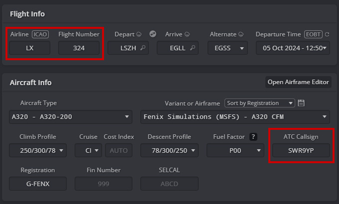
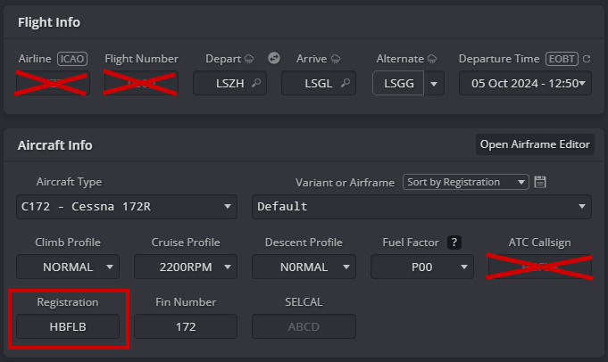

---
hide:
  - navigation
  - toc

og_image: https://wiki.beyondatc.net/assets/cards/card-callsign.png
og_description: This tutorial will help you to use the correct callsign for your flights in Simbrief.
description: This tutorial will help you to use the correct callsign for your flights in Simbrief.

---

# How to set the callsign

This tutorial will help you to use the correct callsign for your flights in Simbrief.

## Airliners callsign

To set an airliner callsign, use the ICAO three-letter prefix assigned to your airline. Each three-letter prefix is uniquely assigned to one operator worldwide. The complete list of ICAO codes is registered by the FAA and can be found on their website: [FAA ICAO Codes](https://www.faa.gov/air_traffic/publications/atpubs/cnt_html/chap3_section_1.html). Here are a few examples of correct callsigns:

- For a Swiss flight: SWR3PH (ATC will call you Swiss 3PH)
- For a British Airways flight: BAW639M (ATC will call you Speedbird 639M)
- For an EasyJet flight: EZY32ZR (ATC will call you Easy 32ZR)

However, it’s important to note that **an airline's ATC callsign is not always the same as the flight number**. In some cases, airlines use different numbers or codes in their callsigns that do not match the flight number. For instance, a British Airways flight might be assigned a flight number **BA545**, but the ATC callsign could be **BAW5GU**. To reflect this, Simbrief allows you to manually override the default callsign by entering a custom one in the **ATC Callsign** field. This option ensures that your callsign matches real-world practices, where the flight number and callsign can differ.

<figure markdown>
  
  <figcaption>Setting a realistic flight number and a callsign</figcaption>
</figure>

**Do not use the two-letter IATA code for your callsign, as it will not be recognized!**

Once you have chosen your callsign, you can enter it in the ATC Callsign field in Simbrief. This will override your airline and flight number set in the previous section.

## General aviation callsign

In most countries, general aviation flights identify themselves using a callsign that corresponds to the aircraft's registration number (also known as the tail number). General aviation callsigns are pronounced letter by letter and number by number using the ICAO phonetic alphabet. You can find the full list of registration country codes on this [CIA website](https://www.cia.gov/the-world-factbook/field/civil-aircraft-registration-country-code-prefix/). Here are a few examples of GA callsigns:

- HB-FLB (Switzerland)
- N595PZ (United States)
- G-BSOG (United Kingdom)
- PT-FRD (Brazil)

To set up a GA callsign, follow these steps:

1. Ensure that the airline, flight number, and ATC callsign fields are empty as you are flying GA
2. Enter the registration number in the Registration field. Remove any hyphens, so HB-FLB would be entered as HBFLB.

<figure markdown>
  
  <figcaption>Setting a General Aviation callsign</figcaption>
</figure>

## Virtual airlines callsign

If you fly a virtual airline, you can activate the option *Prefer VA callsign* in BeyondATC settings to use custom callsign for virtual airlines. Please note that the virtual airline should be registered by the BeyondATC dev team to work.

!!! question "How do I add a VA Callsign?"
    You need to submit a request to the BeyondATC team. You can suggest a VA Callsign on the [Pilot Portal](https://db.beyondatc.net:8000/login). Make sure that your Virtual Airline is active and that you are not the only member.