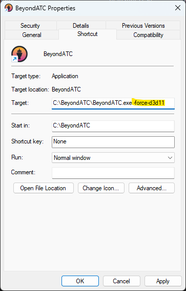

---
hide:
  - navigation
  - toc

og_image: https://wiki.beyondatc.net/assets/cards/card-core-engine.png
og_description: This tutorial will help you to change the Core Engine if you are having performance issues or if you have any problem running BeyondATC on your computer.
description: This tutorial will help you to change the Core Engine if you are having performance issues or if you have any problem running BeyondATC on your computer.

---

# Change the BeyondATC Core Engine

The BeyondATC Core Engine has been reworked to prevent performance issues that can arise when it’s being throttled by certain system configurations. This typically happens when BeyondATC is competing for resources with other DirectX 3D applications, such as the Fenix, causing slowdowns. Since every system is unique, there isn’t a one-size-fits-all solution. To address this, BeyondATC gives you the option to choose between three 3D engines: Vulkan (default), OpenGL, or DirectX11.

## When should I consider switching the Core Engine?

Switching the BeyondATC Core Engine might be necessary if:

* You notice performance lags related to traffic (that you can check by enabling the BeyondATC FPS counter in settings)
* The app freezes without any clear cause
* BeyondATC crashes without showing an error message

If you encounter any of these issues, follow the steps below to switch the 3D engine:

1. You'll need to experiment to find out which engine works best for your system. Go to your BeyondATC installation folder. You will find three files: `BeyondATC_ForceDirectX11.bat`, `BeyondATC_ForceDirectX12.bat` and `BeyondATC_ForceOpenGL.bat`. Running one of these files will force BeyondATC to use the respective engine.
2. After launching BeyondATC using one of the .bat files, perform a complete flight and see if the issue persists.
3.  If no further problems occur during your test, you've successfully found the engine that works best for your system.

For convenience, you can modify your BeyondATC shortcut to automatically launch the preferred engine without needing to run the `.bat` file every time. Here's how:

1. Right-click on your BeyondATC shortcut and select **Properties**.
2. In the **Target** field, add the appropriate line based on your chosen engine:
    - For DirectX11, add `-force-d3d11` at the end of the target path.
    - For DirectX12, add `-force-d3d12` at the end of the target path.
    - For OpenGL, add `-force-opengl` at the end of the target path.

<figure markdown>
  
  <figcaption>Update the shortcut target to force the selected engine to run</figcaption>
</figure>

Now, your usual shortcut will automatically launch BeyondATC with the preferred engine.