---

og_image: https://wiki.beyondatc.net/assets/cards/card-cpdlc.png
og_description: Learn how to use CPDLC with BeyondATC.
description: Learn how to use CPDLC with BeyondATC.

---

# How to use CPDLC with the Fenix A320

This page explains how CPDLC works in the Fenix A319 / A320 / A321.  

---

## Initial setup

Before launching your flight, you must configure the Fenix aircraft to use BeyondATC as its ACARS provider.

1. Open the **Fenix App**
2. Go to **Product Configuration**
3. Under **ACARS Provider**, select **BeyondATC**

<figure markdown>
  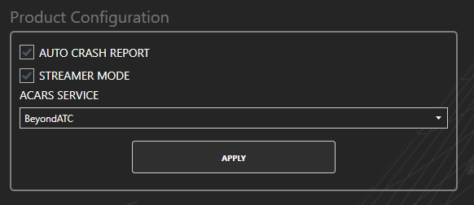
  <figcaption>ACARS provider selection in the Fenix App</figcaption>
</figure>

Once this is set, no further configuration is required in the Fenix App.

---

## Overview

In the Fenix A320, CPDLC/ACARS communication with BeyondATC is handled through:

- **MCDU** (AOC and ATC pages)
- **DCDU** (Data Communication Display Unit), used to receive and acknowledge ATC messages

<figure markdown>
  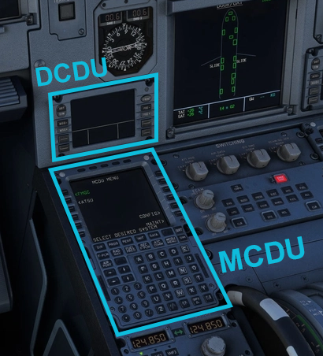
  <figcaption>MCDU and DCDU location on the Airbus A320 family</figcaption>
</figure>

---

## Pre-Departure Clearance

### Import Flight Data into the Aircraft

Before requesting a clearance, the aircraft must be aware of your planned flight. This is done by importing your Simbrief data into the aircraft’s AOC system.

From the cockpit, access the `MCDU MENU`, then open the `AOC MENU` and navigate to `FLT INIT`.  
Selecting `INIT DATA REQ` sends a request to Simbrief and loads your flight information into the aircraft.

<figure markdown>
  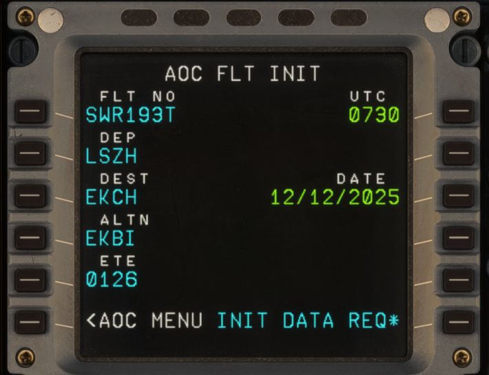
  <figcaption>AOC flight initialization page</figcaption>
</figure>

### Complete the INIT Page

After importing the data, access the `INIT` page and use `INIT REQUEST`, then verify and fill in the remaining fields.  
The most important entry is the `FLT NBR`, which must contain your **callsign** (for example `SWR123`).  
The commercial flight number is not used by ATC and should not be entered here.

You should also confirm the `Cost Index` and `Cruise Level`, usually taken directly from Simbrief.

<figure markdown>
  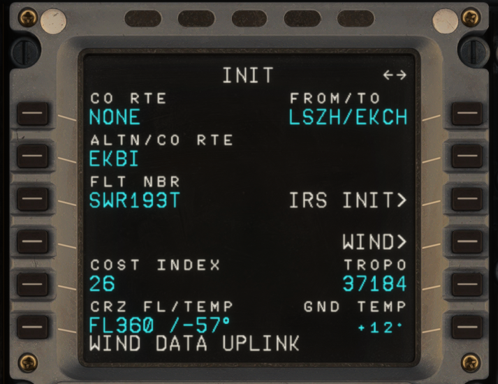
  <figcaption>Flight initialization page</figcaption>
</figure>

### Pre-Departure Clearance Page

Once the aircraft is properly initialized, you can submit the PDC request.

From the `MCDU MENU`, open the `AOC MENU`, then select `ATC REQ` and choose `PRE DEP CLRNCE`.  
This page allows you to provide the final operational details required by ATC.

<figure markdown>
  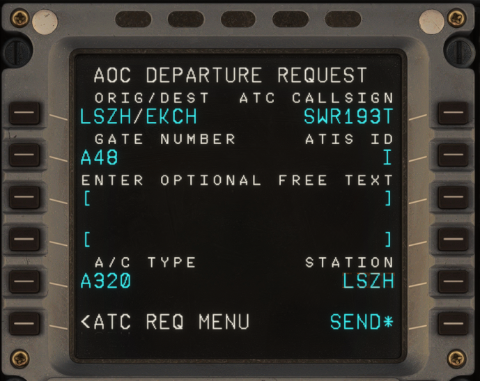
  <figcaption>Pre-departure clearance request page</figcaption>
</figure>

You will be asked to enter your `gate number`, the current `ATIS ID`, and the `station`, which is the ICAO code of your departure airport (e.g. `LSZH`).  
Once all fields are completed, the request can be sent using `SEND`.

### Receive the Clearance on the DCDU

After a short delay, ATC will respond via CPDLC.  
The clearance message appears on the **DCDU**, not on the MCDU itself.

<figure markdown>
  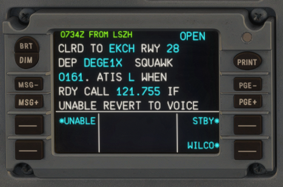
  <figcaption>Pre-departure clearance received on the DCDU</figcaption>
</figure>

The clearance contains the same information you would normally receive by voice, including your cleared route, assigned runway, SID and transition (if applicable), initial climb altitude, squawk code, and any additional instructions.

Take the time to carefully read and note this information before proceeding.  
Once you are ready, acknowledge the clearance by selecting `WILCO` on the DCDU.

ATC will then send a confirmation message indicating that your clearance has been accepted.

<figure markdown>
  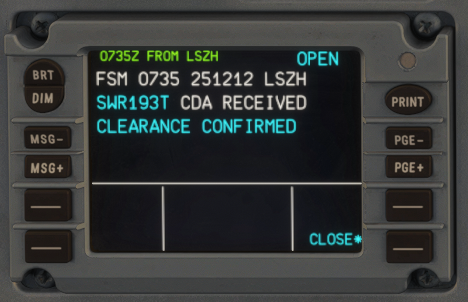
  <figcaption>Clearance confirmation from ATC</figcaption>
</figure>

At this point, you are **IFR cleared**. You may continue your cockpit preparation and, when ready, request pushback using **voice communication**.

---

## Logon to center

After checking in with Center on the correct frequency, access the CPDLC connection pages on the MCDU.

Navigate to the `ATC COMM` page, then select `CONNECTION` followed by `NOTIFICATION`. On this page, you must enter the **ATC Center Code**. This code is displayed in BeyondATC under the **Frequencies** tab for the active Center controller.

Once the correct center code is entered, select `NOTIFY` to send the logon request.

<figure markdown>
  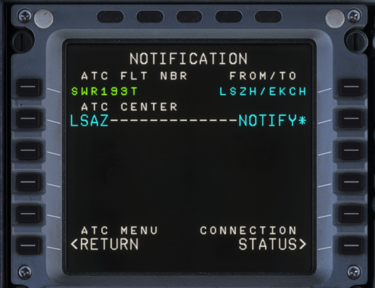
  <figcaption>Notify ATC to establish a CPDLC connection</figcaption>
</figure>

If the logon is successful, ATC will confirm the connection via a message on the **DCDU**. This confirms that CPDLC is now active with the current Center controller.

<figure markdown>
  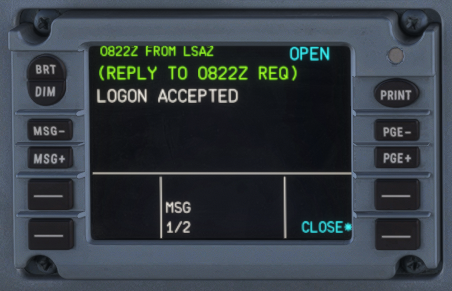
  <figcaption>ATC confirms the CPDLC logon</figcaption>
</figure>

Once accepted, you may begin receiving CPDLC messages in parallel with normal voice communications.

---

## Handoffs

During the flight, ATC will transfer you from one Center to another. When CPDLC is active, these handoffs are delivered via text on the DCDU.

<figure markdown>
  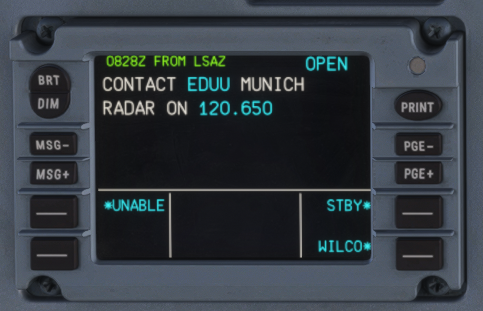
  <figcaption>CPDLC handoff message from ATC</figcaption>
</figure>

The message instructs you to contact the next Center controller. Acknowledge the message using `WILCO`, then tune the newly assigned frequency.

!!! info
    When ATC requests **CONTACT** via CPDLC, you are still required to check in with the next controller **by voice**.  
    CPDLC *MONITOR* operations, which do not require voice contact, are not supported at this time.

---

## Other requests

BeyondATC supports a limited set of CPDLC requests. These allow you to request changes without using the radio, when appropriate.

Currently supported requests include:

- Altitude change requests  
- Direct-to waypoint requests  

To create a request, open the `ATC COMM` page on the MCDU and select `REQUEST`. On this page, you can enter either a desired altitude or a waypoint for a direct routing.

Once the request details are entered, select `XFR TO DCDU`. This transfers the request from the MCDU to the DCDU for review before transmission.

<figure markdown>
  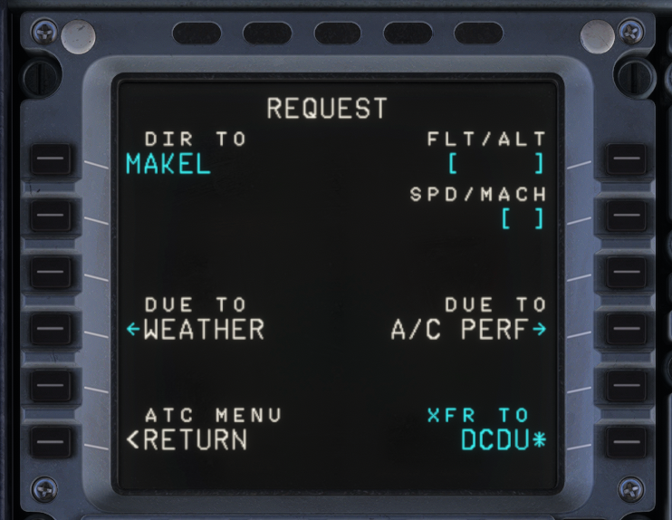
  <figcaption>CPDLC request entry page</figcaption>
</figure>

After transferring the request, it will appear on the **DCDU**. Review the message and select `SEND` to transmit it to ATC.

<figure markdown>
  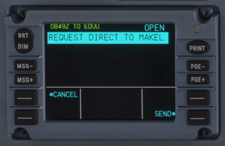
  <figcaption>CPDLC request displayed on the DCDU</figcaption>
</figure>

ATC will respond via CPDLC with one of several possible outcomes, such as approval, denial, or a request to standby. Once a clearance is received and acknowledged, you may comply with the instruction as normal.
