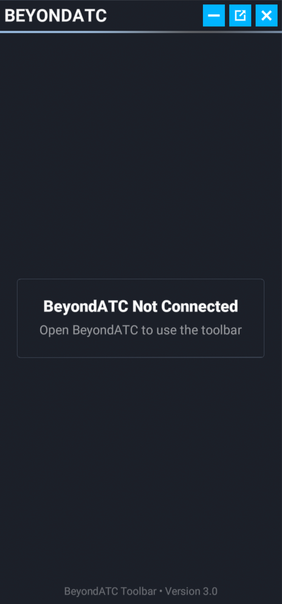
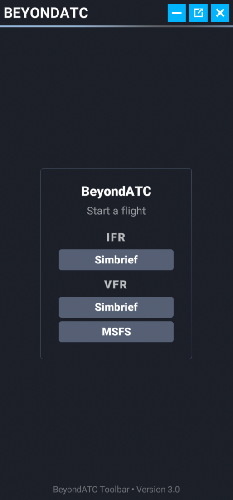
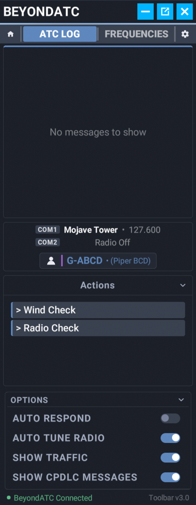
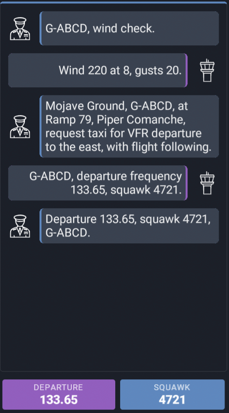
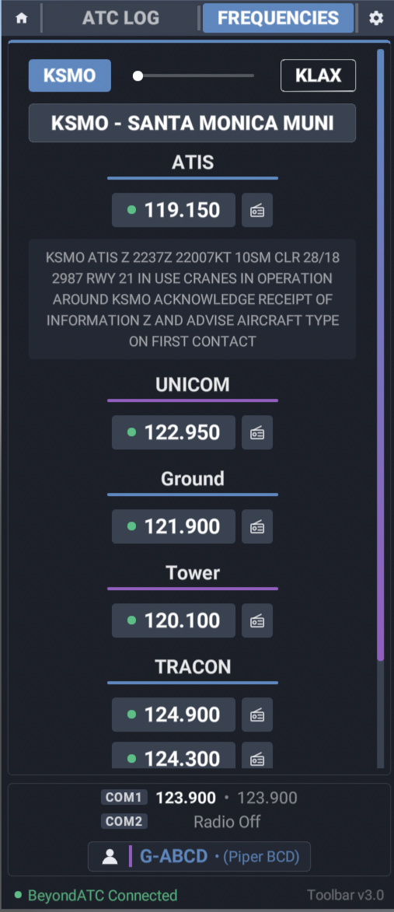
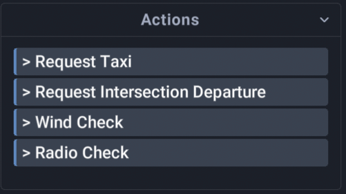
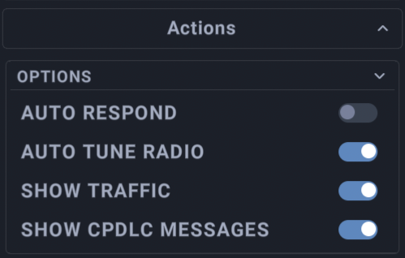
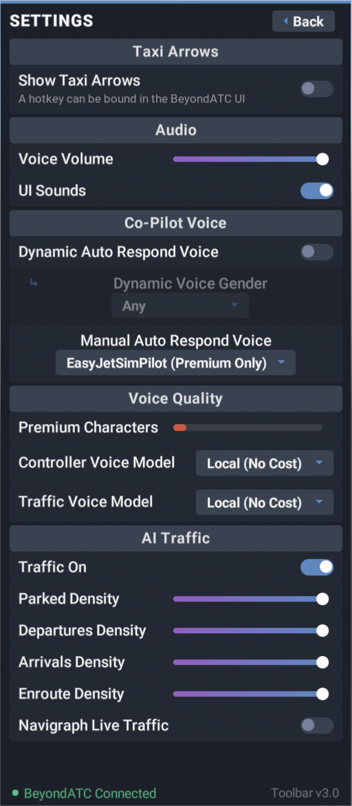

---
hide:
  - navigation
  - toc

og_description: "The BeyondATC Toolbar is an in-sim panel for Microsoft Flight Simulator that mirrors the BeyondATC app. Start flights, read the ATC log, tune frequencies, send requests, and adjust common settings without leaving the cockpit."
description: "The BeyondATC Toolbar is an in-sim panel for Microsoft Flight Simulator that mirrors the BeyondATC app. Start flights, read the ATC log, tune frequencies, send requests, and adjust common settings without leaving the cockpit."

---

# Using the BeyondATC Toolbar

## What it is

The BeyondATC Toolbar is an in-sim panel for Microsoft Flight Simulator 2020 and 2024. It mirrors the parts of the BeyondATC app you use during a flight so you can stay in the cockpit:

- Start and end a flight
- Read the ATC log and see what the controller said
- Tune COM1 or COM2 to any frequency at your departure, destination, or the airports near you
- Send requests and readbacks with the same action buttons as the app
- Adjust voice volume, auto respond, auto tune, and traffic settings

!!! info "Note"
    The toolbar is a companion to the app, not a replacement. BeyondATC must be running on the same PC. All settings remain available in the app.

## Download and installation

1. Download the toolbar from the [BeyondATC download page](https://www.beyondatc.net/download).
2. Extract the archive. It contains a folder named `beyondatc_toolbar`.
3. Copy the `beyondatc_toolbar` folder into your MSFS Community folder.
4. Start, or restart, Microsoft Flight Simulator.

!!! note "Restart after updating"
    The sim caches toolbar panels. After installing a new version of the toolbar, restart Microsoft Flight Simulator so the new version loads.

!!! tip "Finding your Community folder"
    The Community folder location depends on where you installed the sim. The [MSFS 2024 guide](msfs2024.md#traffic-models) covers the default locations for each store.

## Opening the toolbar

Click the BeyondATC icon in the sim toolbar at the top of the screen. The panel can be dragged and resized like any other toolbar panel, and works in VR.

You can also open and close the panel with the sim's ATC menu key (Scroll Lock by default). This is the same key that opens the default MSFS ATC window.

## Connecting

When BeyondATC is not running the panel shows **BeyondATC Not Connected**. Open the app and the panel connects on its own.

## Main menu

When BeyondATC is in the main menu, you can start a flight from within the panel:

- **IFR**: starts an IFR flight using your Simbrief flight plan. Your Simbrief ID must already be set in the app.
- **VFR (Simbrief)**: starts a VFR flight using your Simbrief flight plan.
- **VFR (MSFS)**: starts a VFR flight using the departure and arrival set on the MSFS world map.

While the flight loads the panel shows **BeyondATC Loading** with a progress bar. Any warnings or prompts the app shows, such as a live traffic time mismatch, are mirrored in the panel so you can answer them from the cockpit.

## Flight view

Once a flight is running the panel shows the flight view:

- **Home button**: ends the current flight and returns the app to its main menu. A confirmation is shown first.
- **ATC LOG and FREQUENCIES tabs**
- **Settings gear**
- **Info chips**: the same status chips as the app, such as the assigned squawk or current ATIS letter.
- **Station line**: the station tuned on COM1, the station monitored on COM2, and your callsign.
- **Actions**: the request and readback buttons for the current station.
- **Options bar**: quick toggles for the most used settings.

### ATC Log

The ATC Log tab shows the conversation with ATC. Each message shows who spoke and what was said.

Use the filters under the options at the bottom of the ATC Log to filter out messages from AI traffic and CPDLC messages.

### Frequencies

The Frequencies tab lists the frequencies for your departure and destination airports. Use the buttons at the top to switch between airports.

Each station shows:

- The station name and frequency. Click it to tune COM1.
- A **COM2** button to monitor the station on COM2 without leaving your current frequency.
- Active Runway tags under the station for the runways it controls.
- ATIS and automated weather stations showing the current broadcast text if the airport operates one.

### Actions

The Actions area lists the requests and readbacks available on the current frequency, for example to request taxi, or ask for a radio check.

While a request is queued or a transmission is in progress the area shows the current status. If you are doing an IFR turnaround the **Start Turnaround** button will also appear here.

### Options bar

The bar at the bottom of the ATC log allows you to configure the following:

- **Auto Respond**: the copilot reads back ATC instructions for you.
- **Auto Tune Radio**: the radio tunes to the next frequency when you are handed off.
- **Show Traffic**: shows AI traffic messages in the ATC log.
- **Show CPDLC Messages**: shows CPDLC messages in the ATC log.

## Settings

Click the gear to open the settings page. It covers the common settings you may want to change during a flight. 

!!! warning "Note"
    Some settings must be set directly in BeyondATC, for example keybinds, modal matching and general settings.

- **Taxi Arrows**: toggles showing or hiding the taxi arrows in the sim. You will only be set to on when you receive a taxi instruction (Taxi arrows works only in MSFS 2024).
- **Audio**: voice volume and UI sounds.
- **Copilot voice**: dynamic or manual auto respond voice.
- **Voice models**: the controller and traffic voice models. the amount of Premium characters you have remaining are also shown, for those who use premium voices.
- **Traffic**: traffic on or off, parked, departures, arrivals, and enroute density, as well as the ability to toggle Navigraph live traffic on and off.

Click **Back** to return to the flight view.

## Status footer

The footer shows the connection status and the toolbar version. If the version of BeyondATC you are running expects a newer toolbar, **Update Available** is shown next to the version number. To update, simply download the latest toolbar from the [download page](https://www.beyondatc.net/download), replace the folder in your Community folder.

!!! warning "Important"
    Ensure you have the sim closed when updating the toolbar!

## Troubleshooting

- **The icon does not appear in the sim toolbar**: check that the `beyondatc_toolbar` folder is directly inside the Community folder and not nested in another folder, then restart the sim.
- **The panel stays on Not Connected**: make sure BeyondATC is running and has finished starting up.
- **The panel is empty or out of date after an update**: restart the sim so the cached panel is replaced.

If you still have issues, ask in our Discord server or see [Bug reporting](../support/bug-reporting.md).
