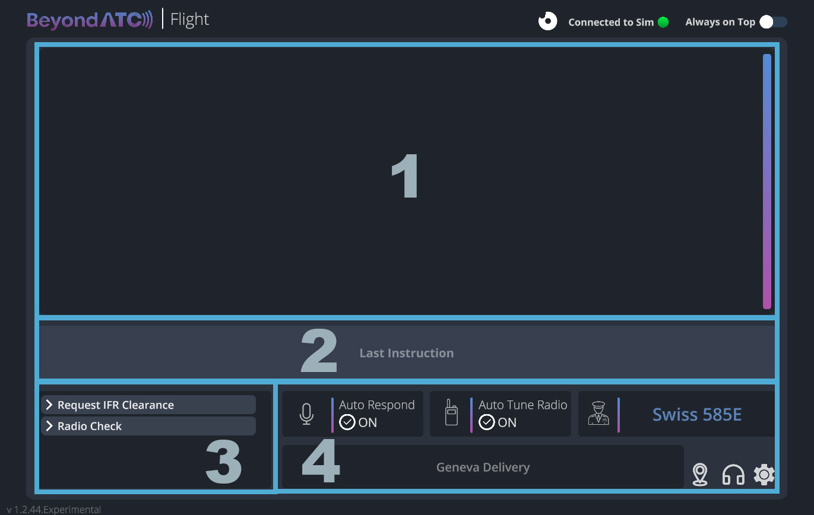

# The Basics

## Download BeyondATC

Download the latest version of the installer here: [https://www.beyondatc.net/download](https://www.beyondatc.net/download)

Launch the installer as an administrator and install the software.

---

## License purchase

Once you installed BeyondATC, you can create your account. For this, you need to provide a username (careful, it's **case sensitive**), a password and an email address. Once your account is created, you can buy the license, which will be linked to your account. 

Go to the *store* and choose the Pack you want to purchase. If you need more details about the packs, you can look at the [pricing page](pricing.md).

!!! info "Payment process"
    In some cases, the app might continue to display a "waiting for purchase to complete" message even after your payment has been accepted. If this happens, simply restart the app. Before doing so, ensure that the payment was successfully processed.

---

## Setting up BeyondATC

### Simbrief

BeyondATC loads the flight plan from [Simbrief](https://www.simbrief.com), which is a free virtual flight planning tool. If you don’t have an account, please create an free account to link it with BeyondATC.

You need to insert your [Simbrief Pilot ID](https://dispatch.simbrief.com/account) in BeyondATC window (numbers only).

!!! tip "Setting up your flight plan"
    If you don't know how to properly set up your flight plan, please follow our [beginner guide](../beginner-guide/preflight.md) that will explain you how to create a fully working flight plan for BeyondATC.

### BeyondATC settings

Go into options to set BeyondATC settings

Settings in details:

??? note "General"

    | Setting                             | Detail                                                                            |
    | ----------------------------------- | --------------------------------------------------------------------------------- |
    | Low performance mode                | Used to reduce computing power (but can affect quality of traffic movement)       |
    | Streamer Mode                       | Hide the Simbrief ID on launch                                                    |
    | Radio Degradation Simulation        | Simulates the loss of radio quality over large distances                          |
    | Use International Basic Accents     | If this option is activated, accents will be used with Basic Voices. Please note that these accents may be difficult to understand as they are not natively english based models. *This option has no effects if you use Premium Voices* |
    | Prefer VA Callsigns                 | If you want to fly a virtual airline, you can activate this option. It will use any virtual airline callsign that is registered by BeyondATC |
    
    !!! question "How do I add a VA Callsign?"
        You need to submit a request to the BeyondATC team. You can suggest a VA Callsign here: https://beyondatc.nolt.io
        
??? note "Key Bindings"

    | Setting                             | Detail                                                                            |
    | ----------------------------------- | --------------------------------------------------------------------------------- |
    | Push to Talk                        | You can set up to two bindings to activate the push to talk option                |
    | Toggle Bring to Front               | The binding will bring the BeyondATC to front and hide it                         |
    | Fire Action 1                       | This binding will activate the first option in the list of actions                |
        
??? note "Audio"

    | Setting                    | Detail                                                                                                    |
    | -------------------------- | --------------------------------------------------------------------------------------------------------- |
    | Voice Volume               | Set voice volume from ATC and traffic                                                                     |
    | UI Sounds                  | Turn on/off UI sounds. The beeps acknowledge successful activation of PTT and message reception from ATC. |
    | Input device               | Select the input device you want to use                                                                   |
    | Auto Respond Voice         | You can select the voice that will be used with the auto respond function.                                |
        
??? note "AI Traffic"
    | Setting                    | Detail                                                                                                    |
    | -------------------------- | --------------------------------------------------------------------------------------------------------- |
    | Traffic on                 | Activate or deactivate AI traffic.                                                                      |
    | Traffic density            | The slider controls the time range for aircraft parked at the gates. A setting of 1 represents a short time range, while 10 represents a longer one. The higher the slider value, the more aircraft will be parked at the gates. This is because planes will remain at the gates longer before their scheduled departure or after their arrival, based on real-world data.
    
    Please note that this slider only affects how long aircraft stay parked at the gates; it does not influence the actual takeoffs or landings, which follow the real-world departure and arrival times for that time of day. |
        
??? note "Voice Quality"

    | Setting                | Detail                                                                            |
    | ---------------------- | --------------------------------------------------------------------------------- |
    | Controller Voice Model | Voices that will be used for controllers. You can select basic (free) or premium voices (will use Premium Characters) |
    | Traffic Voice Model    | Voices that will be used for traffic. You can select basic (free) or premium voices (will use Premium Characters) |

### Setting up AI Traffic

!!! info
    AI Traffic is currently available only to owners of the **Supporters Pack**. It will be made available to all users later, at no additional cost.

1. **Close any other traffic injector**  
   Make sure to close any other traffic injectors, but keep the aircraft models from your preferred injector. BeyondATC needs to have models from one of these injectors to work properly:

    - FSLTL
    - Alpha India Group (AIG)
    - FS Traffic

    We currently recommend using **FSLTL models**, as they offer the best integration with the system.

2. **Install models (if needed)**  
   If you don’t have any aircraft models installed, you can download the FBW installer and install the Base Models from **FSLTL traffic**:  [Download FBW Installer](https://api.flybywiresim.com/installer)

3. **Disable MSFS Traffic**  
    Before starting your flight, make sure you have disabled all traffic settings in MSFS.

4. **Switch to the Experimental Branch**  
   Go to your account page in BeyondATC and switch to the **Experimental** version. Then, launch **BeyondATC** (you may need to run it as an administrator if you don't see any traffic).

5. **Check traffic settings in BeyondATC**  
   In BeyondATC’s settings, confirm that **Traffic** is turned **ON**. The recommended traffic density is set to **5** for optimal performance.

6. **Launch your flight**  
   You’re now ready to launch your flight and enjoy the AI traffic integration!
    
---

## Setting up your microphone

To ensure the app can access and use your microphone properly, go to Settings > Privacy & Security and follow these steps:

1. **Enable Microphone Access**:  
Select Microphone and make sure the Microphone access toggle is set to On.

2. **Allow Desktop Apps Access**:  
Scroll down to the Allow desktop apps to access your microphone section.
Toggle this setting to On to ensure that desktop applications, including BeyondATC, can access the microphone.

---

## Setting up MSFS

To ensure BeyondATC functions correctly, you need to configure the following settings to prevent any interference or alterations by Microsoft Flight Simulator.

### Disable ATC assistance options

Go to Options &gt; Assistance Options

Under User Experience, turn off:  

- ATC Enforce flight plan
- ATC UI Panel open at start
- ATC Voices

Under Piloting, turn off:  

- AI Radio Communications

### Disable traffic options

**All traffic injectors should be disabled.** BeyondATC cannot detect, interact with, or manage any traffic that it has not injected itself. This means that third-party injectors such as FSLTL, MSFS live traffic, and similar are not supported.

To adjust the traffic settings, follow these steps:

1. Go to **Options** > **General Options** > **Traffic**.
2. Set the following options:
    - **Aircraft Traffic Type**: OFF
    - **Ground Aircraft Density**: 0

Before starting your flight, on the world map, click on **Flight Conditions** and make sure that both **Multiplayer** and **Air Traffic** are set to OFF. Also, ensure that **Live Weather** is selected.

!!! info
    BeyondATC only supports **Live Weather** due to MSFS limitations. For accurate weather reports from ATIS, Live Weather must be enabled. However, you can choose the time of day to reflect the desired traffic for that time

---

## BeyondATC interface

### 1. Main display area  
This is the central information panel where communication with ATC and other important updates are displayed. It shows active communications, clearances, and ongoing messages during your flight. You can monitor all ATC interactions with you and traffic here.

### 2. Last instruction  
This section displays the **last instruction** received from ATC, with key information presented in boxes. This feature is especially useful when multiple communications are taking place, as new messages in the main area might push previous instructions out of view. The boxes keep important details easily accessible so you can refer to them quickly when needed.

### 3. Action buttons  
This area contains pre-set actions for interacting with ATC. These buttons allow you to manually perform key actions without relying on voice interaction. It also show the possible actions that can be requested by voice to this frequency.

### 4. Control settings  
This section allows you to manage automated settings:

- **Auto Respond**: When enabled, the system automatically responds to ATC instructions without requiring user input. You can toggle this ON/OFF depending on your preference.
- **Auto Tune Radio**: This ensures that your radio is automatically tuned to the correct frequency when ATC tranfers you to another channel.

It also displays which ATC service or frequency you’re currently communicating with (e.g., **Geneva Delivery**), along with your flight callsign (e.g., **Swiss 585E**). This helps keep track of your current communication status.

#### Additional Controls  
- **Settings icon**: Click this to open the settings menu, where you can adjust preferences like traffic density, sound options, and more.
- **Headset icon**: Displays a list of available frequencies. You can tune to a frequency by clicking on it.
- **Map icon**: Shows the airport map for your current location. After requesting taxi, it will display your taxi route to the runway or your assigned gate.

