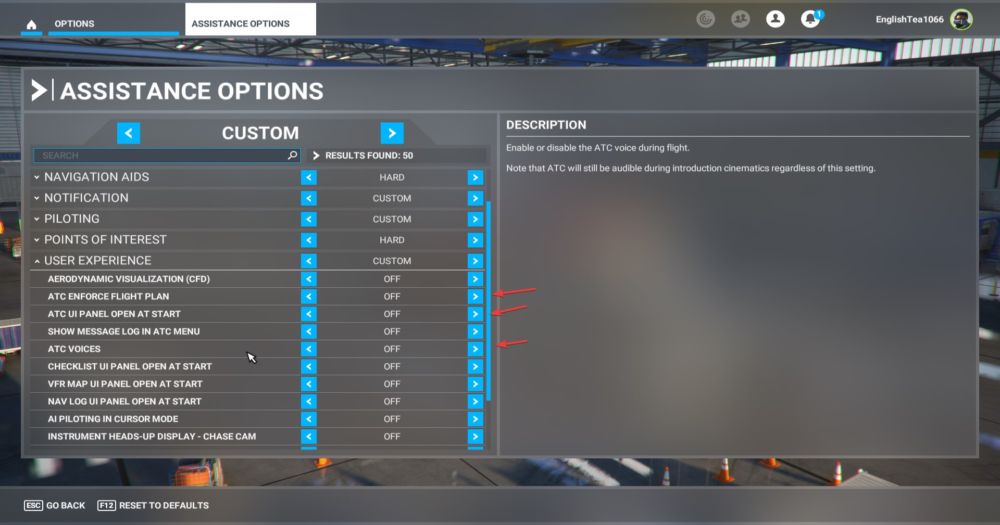
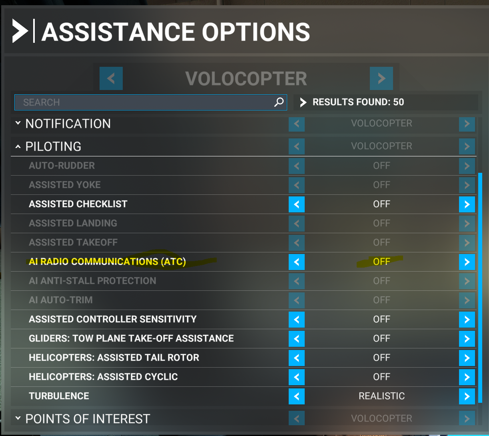

# The Basics

## Download BeyondATC

Download the latest version of the installer here: [https://www.beyondatc.net/download](https://www.beyondatc.net/download)

Launch the installer as an administrator and install the software.

---

## License purchase

Once you installed BeyondATC, you can create your account. For this, you need to provide a username (careful, it's **case sensitive**), a password and an email address. Once your account is created, you can buy the license, which will be linked to your account. 

Go to the *store* and choose the Pack you want to purchase. If you need more details about the packs, you can look at the [pricing page](pricing.md).

!!! info "Payment process"
    In some cases, the app might continue to display a "waiting for purchase to complete" message even after your payment has been accepted. If this happens, simply restart the app. Before doing so, ensure that the payment was successfully processed.

---

## Setting up BeyondATC

### Simbrief

BeyondATC loads the flight plan from [Simbrief](https://www.simbrief.com), which is a free virtual flight planning tool. If you don’t have an account, please create an free account to link it with BeyondATC.

You need to insert your [Simbrief Pilot ID](https://dispatch.simbrief.com/account) in BeyondATC window (numbers only).

!!! tip "Setting up your flight plan"
    If you don't know how to properly set up your flight plan, please follow our [beginner guide](../beginner-guide/preflight.md) that will explain you how to create a fully working flight plan for BeyondATC.

### BeyondATC settings

Go into options to set BeyondATC settings

Settings in details:

??? note "General"
    - **Low performance mode**  
    Used to reduce computing power (but can affect quality of traffic movement)
    - **Streamer Mode**  
    Hide the Simbrief ID on launch
    - **Radio Degradation Simulation**  
    Simulates the loss of radio quality over large distances
    - **Use International Basic Accents**  
    If this option is activated, accents will be used with Basic Voices. Please note that these accents may be difficult to understand as they are not natively english based models.
    *This option has no effects if you use Premium Voices*
    - **Prefer VA Callsigns**  
    If you want to fly a virtual airline, you can activate this option. It will use any virtual airline callsign that is registered by BeyondATC
    
    !!! question "How do I add a VA Callsign?"
        You need to submit a request to the BeyondATC team. You can suggest a VA Callsign here: https://beyondatc.nolt.io
        
??? note "Key Bindings"
    - **Push to Talk**  
    You can set up to two bindings to activate the push to talk option
    - **Toggle Bring to Front**  
    The binding will bring the BeyondATC to front and hide it
    - **Fire Action 1**  
    This binding will activate the first option in the list of actions
        
??? note "Audio"
    - **Voice Volume**  
    Set voice volume from ATC and traffic
    - **UI Sounds**  
    Turn on/off UI sounds. The beeps acknowledge successful activation of PTT and message reception from ATC.
    - **Input device**  
    Select the input device you want to use
    - **Auto Respond Voice**  
    You can select the voice that will be used with the auto respond function.
        
??? note "AI Traffic"
    AI Traffic is not implemented yet.
        
??? note "Voice Quality"
    - **Controller Voice Model**  
    Voices that will be used for controllers. You can select basic (free) or premium voices (will use Premium Characters)
    - **Traffic Voice Model**  
    Voices that will be used for traffic. You can select basic (free) or premium voices (will use Premium Characters)

---

## Setting up your microphone

To ensure the app can access and use your microphone properly, go to Settings > Privacy & Security and follow these steps:

1. **Enable Microphone Access**:  
Select Microphone and make sure the Microphone access toggle is set to On.

2. **Allow Desktop Apps Access**:  
Scroll down to the Allow desktop apps to access your microphone section.
Toggle this setting to On to ensure that desktop applications, including BeyondATC, can access the microphone.

---

## Setting up MSFS

To ensure BeyondATC functions correctly, you need to configure the following settings to prevent any interference or alterations by Microsoft Flight Simulator assistance.

Go to Options > Assistance Options

Under User Experience, turn off:  

- ATC Enforce flight plan
- ATC UI Panel open at start
- ATC Voices

Under Piloting, turn off:  

- AI Radio Communications

