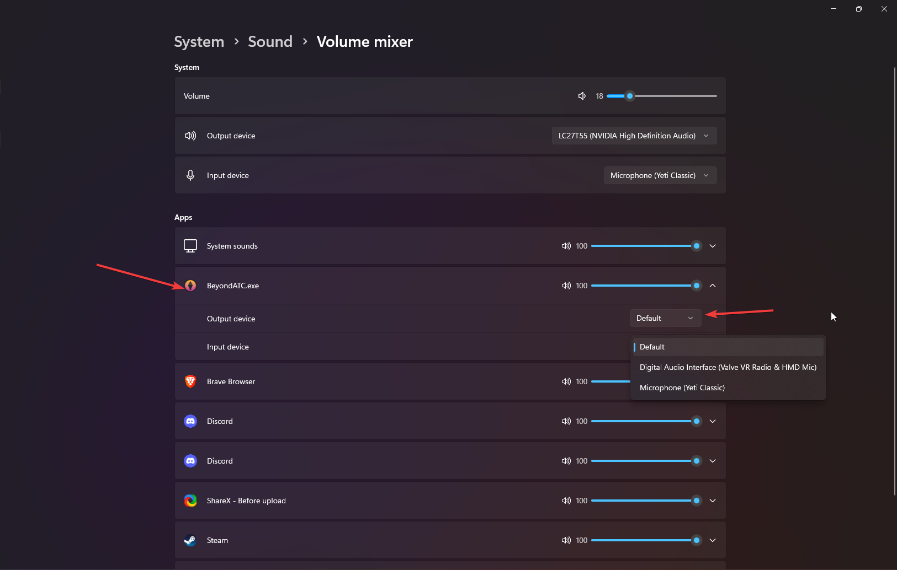

Currently, you cannot change the output device directly from BeyondATC. Navigate to Windows Settings > System > Sound > Volume Mixer

Find BeyondATC and change the *Output device* to the device you want.

